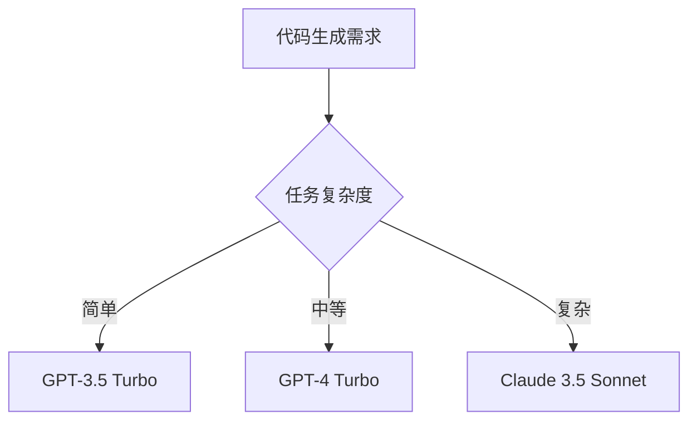
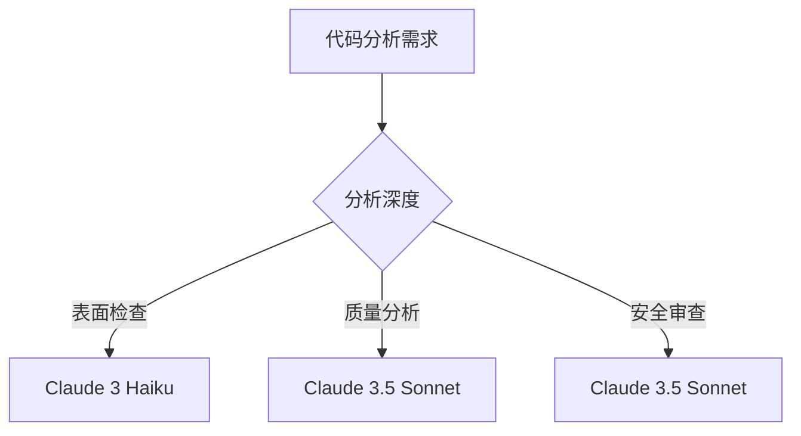
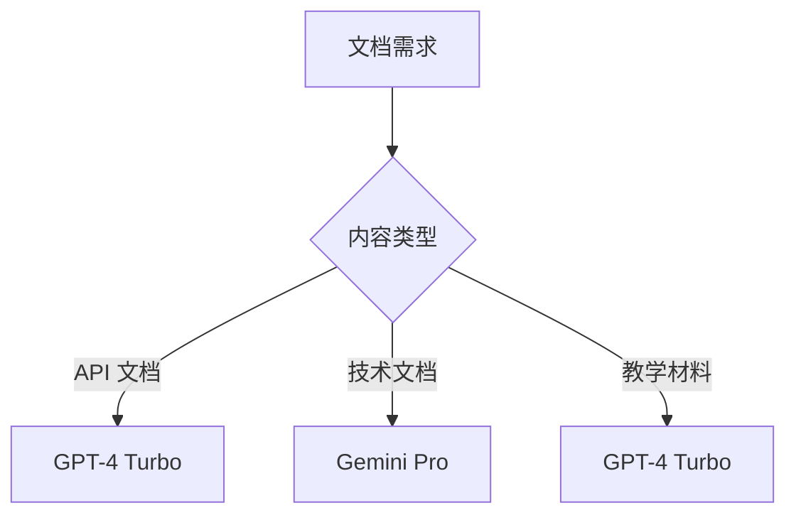

---
# SEO 配置
title: "Qoder 支持的 AI 模型 - Claude、GPT-4、Gemini 等全面对比"
description: "Qoder 支持的 AI 模型全面介绍，包括 OpenAI GPT-4 Turbo、Anthropic Claude 3.5 Sonnet、Google Gemini Pro 等。详细对比各模型的优势、性能、价格和适用场景。"
keywords: "Qoder AI 模型, Claude 3.5 Sonnet, GPT-4 Turbo, Gemini Pro, AI 模型对比, 代码生成模型, Anthropic, OpenAI, Google AI, 智能编程模型"

# Open Graph 配置
head:
  - - meta
    - property: og:title
      content: "Qoder 支持的 AI 模型 - Claude、GPT-4、Gemini 全面对比"
  - - meta
    - property: og:description
      content: "支持 Claude 3.5、GPT-4 Turbo、Gemini Pro 等世界领先的 AI 模型。"
  - - meta
    - property: og:type
      content: article
  - - meta
    - property: og:url
      content: https://caug.cn/docs/supported-models
  - - meta
    - property: article:section
      content: "AI 模型"
  
  # 结构化数据
  - - script
    - type: application/ld+json
    - |
      {
        "@context": "https://schema.org",
        "@type": "TechArticle",
        "headline": "Qoder 支持的 AI 模型",
        "description": "Claude、GPT-4、Gemini 等 AI 模型的全面对比和介绍",
        "url": "https://caug.cn/docs/supported-models",
        "datePublished": "2025-08-24",
        "author": {
          "@type": "Organization",
          "name": "Qoder Team"
        },
        "about": "AI 模型对比和选择"
      }
---

# 支持的 AI 模型

Qoder 支持业界领先的 AI 模型，为您提供最佳的代码生成和分析体验。每个模型都有其独特的优势和适用场景。

## 模型概览

| 模型 | 提供商 | 专长领域 | 推荐场景 |
|------|--------|----------|----------|
| Claude 3.5 Sonnet | Anthropic | 代码分析、重构 | 复杂代码理解、架构设计 |
| GPT-4 Turbo | OpenAI | 代码生成、创新 | 快速原型开发、多语言支持 |
| Gemini Pro | Google | 多模态、推理 | 文档生成、跨语言转换 |
| Claude 3 Haiku | Anthropic | 快速响应 | 代码补全、简单任务 |
| GPT-3.5 Turbo | OpenAI | 成本效益 | 日常编程任务 |

## Claude 3.5 Sonnet

### 特性
- **卓越的代码理解**: 能够深度理解复杂的代码结构和逻辑
- **精准的重构建议**: 提供高质量的代码重构和优化建议
- **强大的推理能力**: 在复杂问题解决方面表现出色
- **安全意识**: 内置安全编程最佳实践

### 优势
```markdown
✅ 代码质量分析
✅ 架构设计建议
✅ 复杂算法实现
✅ 代码审查和优化
✅ 安全漏洞检测
```

### 适用场景
- **企业级应用开发**: 需要高质量、可维护的代码
- **代码审查**: 自动化代码质量检查
- **架构重构**: 大规模代码库的重构和优化
- **安全编程**: 需要安全意识的代码生成

### 配置示例
```json
{
  "model": "claude-3-5-sonnet-20241022",
  "api_key": "sk-ant-...",
  "max_tokens": 4096,
  "temperature": 0.2,
  "system_prompt": "你是一个专业的代码审查专家，专注于代码质量和最佳实践。"
}
```

## GPT-4 Turbo

### 特性
- **广泛的语言支持**: 支持几乎所有主流编程语言
- **创新性解决方案**: 能够提供创新的编程思路
- **快速代码生成**: 高效的代码生成能力
- **丰富的知识库**: 基于大量开源代码训练

### 优势
```markdown
✅ 快速原型开发
✅ 多语言项目支持
✅ 创新算法设计
✅ API 集成代码
✅ 文档和注释生成
```

### 适用场景
- **快速原型**: 需要快速验证想法的项目
- **多语言开发**: 涉及多种编程语言的项目
- **API 开发**: RESTful API 和微服务开发
- **学习和教学**: 代码示例和教程生成

### 配置示例
```json
{
  "model": "gpt-4-turbo-preview",
  "api_key": "sk-...",
  "max_tokens": 4096,
  "temperature": 0.3,
  "system_prompt": "你是一个全栈开发专家，擅长多种编程语言和框架。"
}
```

## Gemini Pro

### 特性
- **多模态能力**: 能够处理代码、图片、文档等多种输入
- **强大的推理**: 在逻辑推理和问题解决方面表现优秀
- **文档理解**: 能够理解和生成技术文档
- **跨语言转换**: 支持代码在不同语言间的转换

### 优势
```markdown
✅ 技术文档生成
✅ 代码语言转换
✅ 图表和流程图理解
✅ 多模态代码分析
✅ 复杂逻辑推理
```

### 适用场景
- **文档工程**: 自动生成和维护技术文档
- **代码迁移**: 将代码从一种语言转换为另一种
- **需求分析**: 基于需求文档生成代码
- **多媒体项目**: 涉及图片、视频处理的项目

### 配置示例
```json
{
  "model": "gemini-pro",
  "api_key": "AIza...",
  "max_tokens": 2048,
  "temperature": 0.3,
  "system_prompt": "你是一个技术文档专家，擅长代码分析和跨语言转换。"
}
```

## Claude 3 Haiku

### 特性
- **超快响应**: 毫秒级的响应时间
- **轻量高效**: 适合频繁调用的场景
- **代码补全优化**: 专门优化的代码补全功能
- **低延迟**: 实时代码建议

### 优势
```markdown
✅ 实时代码补全
✅ 快速语法检查
✅ 简单任务处理
✅ 低成本高频使用
✅ 响应速度快
```

### 适用场景
- **代码补全**: 实时的智能代码补全
- **语法检查**: 快速的语法错误检测
- **简单重构**: 变量重命名、简单优化
- **学习辅助**: 编程学习过程中的快速帮助

## GPT-3.5 Turbo

### 特性
- **成本效益**: 相对较低的使用成本
- **稳定性能**: 经过验证的稳定性能
- **广泛适用**: 适合大多数常见编程任务
- **快速响应**: 良好的响应速度

### 优势
```markdown
✅ 日常编程任务
✅ 成本控制友好
✅ 稳定可靠
✅ 基础代码生成
✅ 简单问题解决
```

### 适用场景
- **日常开发**: 常见的编程任务
- **教育环境**: 编程教学和学习
- **预算敏感**: 需要控制 API 成本的项目
- **批量处理**: 大量简单任务的处理

## 模型选择建议

### 根据任务类型选择

#### 代码生成和开发


#### 代码分析和审查


#### 文档和教学


### 性能对比

| 维度 | Claude 3.5 | GPT-4 Turbo | Gemini Pro | Claude 3 Haiku | GPT-3.5 |
|------|------------|-------------|------------|----------------|---------|
| 代码质量 | ⭐⭐⭐⭐⭐ | ⭐⭐⭐⭐ | ⭐⭐⭐⭐ | ⭐⭐⭐ | ⭐⭐⭐ |
| 响应速度 | ⭐⭐⭐ | ⭐⭐⭐ | ⭐⭐⭐ | ⭐⭐⭐⭐⭐ | ⭐⭐⭐⭐ |
| 创新性 | ⭐⭐⭐⭐ | ⭐⭐⭐⭐⭐ | ⭐⭐⭐⭐ | ⭐⭐ | ⭐⭐⭐ |
| 成本效益 | ⭐⭐⭐ | ⭐⭐ | ⭐⭐⭐ | ⭐⭐⭐⭐⭐ | ⭐⭐⭐⭐⭐ |
| 多语言支持 | ⭐⭐⭐⭐ | ⭐⭐⭐⭐⭐ | ⭐⭐⭐⭐ | ⭐⭐⭐ | ⭐⭐⭐⭐ |

## 混合使用策略

### 智能模型切换
Qoder 支持基于任务类型自动选择最适合的模型：

```json
{
  "autoModelSelection": {
    "enabled": true,
    "rules": {
      "codeCompletion": "claude-3-haiku",
      "codeGeneration": "gpt-4-turbo",
      "codeReview": "claude-3-5-sonnet",
      "documentation": "gemini-pro",
      "debugging": "claude-3-5-sonnet"
    }
  }
}
```

### 成本优化
根据预算和需求优化模型使用：

```json
{
  "costOptimization": {
    "dailyBudget": 50,
    "fallbackModel": "gpt-3.5-turbo",
    "priorityTasks": ["codeReview", "debugging"],
    "budgetAlerts": true
  }
}
```

## API 配置

### 获取 API 密钥

#### OpenAI
1. 访问 [OpenAI Platform](https://platform.openai.com/)
2. 创建账户并验证
3. 前往 API Keys 页面
4. 创建新的 API 密钥

#### Anthropic
1. 访问 [Anthropic Console](https://console.anthropic.com/)
2. 注册并完成验证
3. 在 API Keys 部分获取密钥

#### Google AI
1. 访问 [Google AI Studio](https://aistudio.google.com/)
2. 使用 Google 账户登录
3. 创建新的 API 密钥

### 安全配置

```json
{
  "security": {
    "encryptApiKeys": true,
    "apiKeyRotation": "monthly",
    "rateLimiting": {
      "enabled": true,
      "requestsPerMinute": 60
    },
    "auditLogging": true
  }
}
```

## 监控和分析

### 使用统计
Qoder 提供详细的模型使用统计：

- **请求次数**: 按模型和时间统计
- **成本分析**: 实时成本跟踪
- **响应时间**: 性能监控
- **成功率**: 请求成功率统计

### 性能监控
```json
{
  "monitoring": {
    "responseTime": {
      "threshold": 2000,
      "alerting": true
    },
    "errorRate": {
      "threshold": 0.05,
      "alerting": true
    },
    "costTracking": {
      "enabled": true,
      "alerts": ["daily", "weekly", "monthly"]
    }
  }
}
```

## 故障排除

### 常见问题

#### API 连接失败
1. 检查网络连接
2. 验证 API 密钥有效性
3. 确认账户余额充足
4. 检查 API 端点可用性

#### 响应质量问题
1. 调整模型参数 (temperature, max_tokens)
2. 优化 system prompt
3. 提供更多上下文信息
4. 尝试不同的模型

#### 成本控制
1. 设置日/月预算限制
2. 使用成本效益更高的模型
3. 优化请求频率
4. 启用智能缓存

---

选择合适的 AI 模型是获得最佳编程体验的关键。Qoder 的多模型支持让您能够根据具体需求选择最适合的 AI 助手。